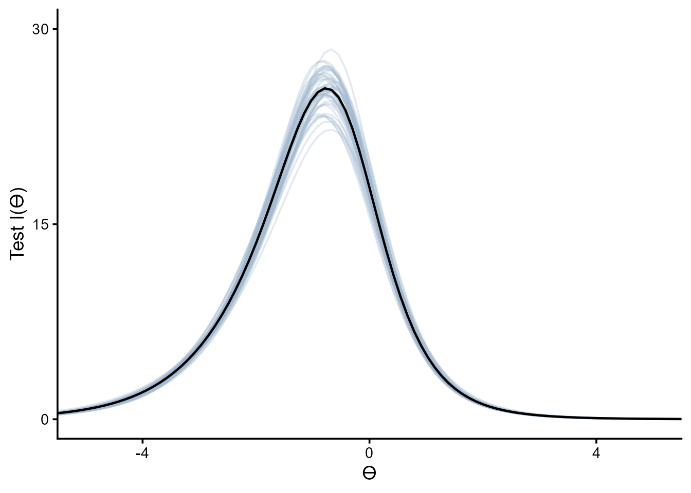
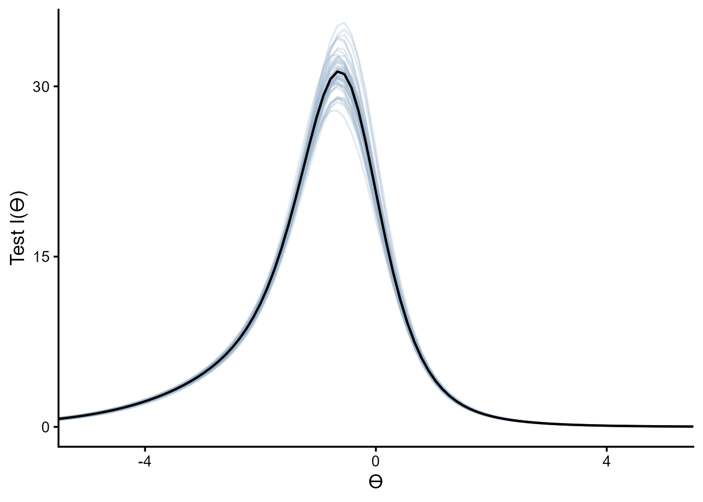
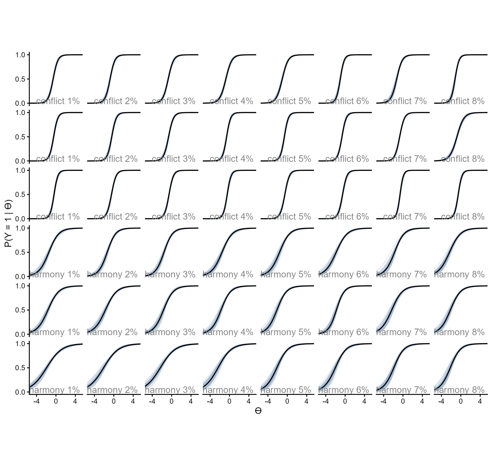
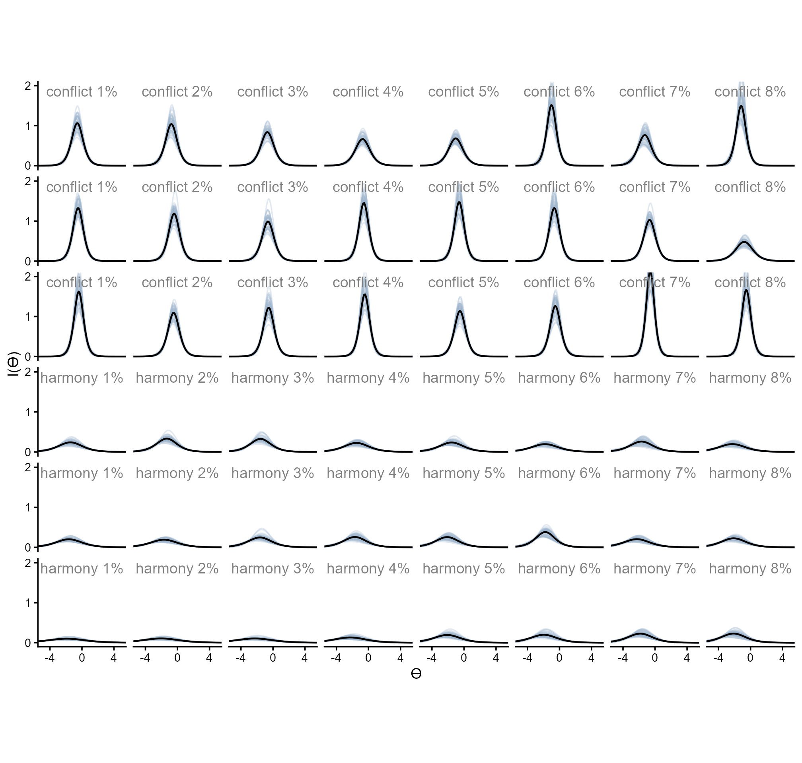
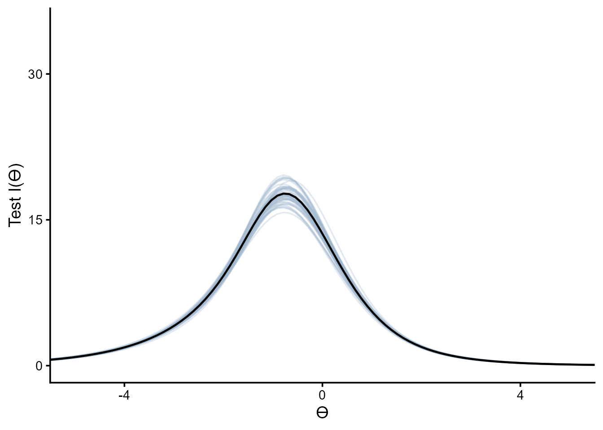
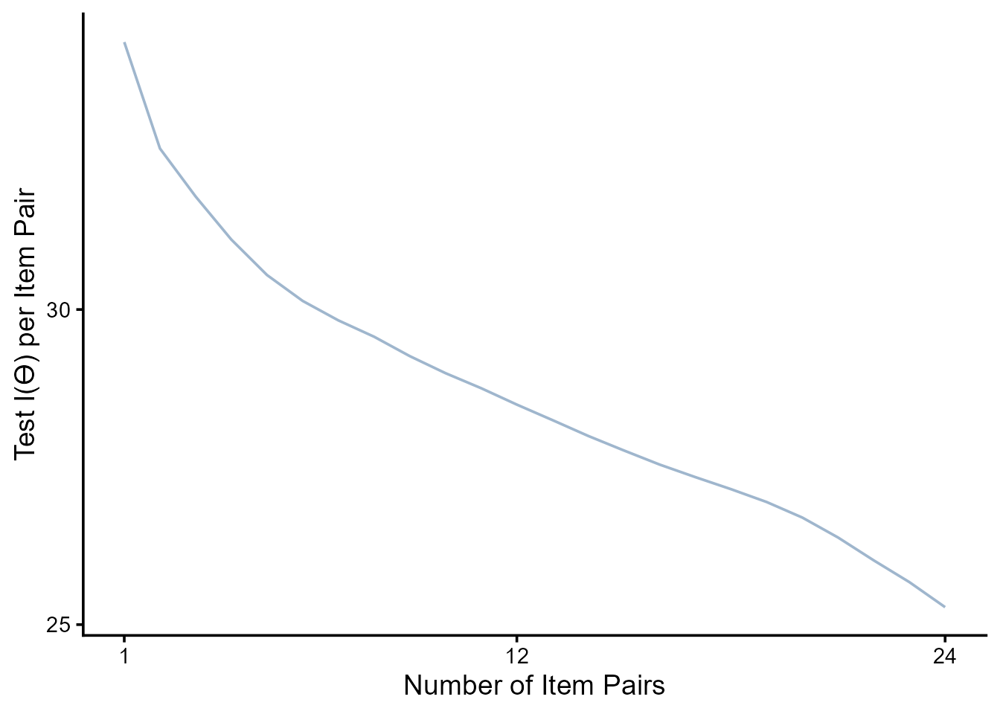

#### Setup


::: {.cell}

```{.r .cell-code}
library(tidyverse)
library(rstan)

set_theme(theme_classic(base_size = 16, paper = "#eceadf"))

options(mc.cores = parallel::detectCores())

set.seed(123)
```
:::


::: {.cell}

```{.r .cell-code}
dn_full <- rio::import("https://raw.githubusercontent.com/forecastingresearch/fpt/refs/heads/main/data_cognitive_tasks/task_datasets/data_denominator_neglect.csv")

anchoraig_full <- rio::import("https://raw.githubusercontent.com/forecastingresearch/fpt/refs/heads/main/data_cognitive_tasks/metadata_tables/task_aig_version.csv")
```
:::


#### Cleaning

::: panel-tabset
#### Combined

::: {.cell}

```{.r .cell-code}
anchor_ids_c <- anchoraig_full %>%
  filter(task == "denominator_neglect_version_A" |
           task == "denominator_neglect_version_B") %>%
  mutate(task_version = factor(ifelse(task == "denominator_neglect_version_A", "A", "B"))) %>%
  filter(AIG_version == "anchor" & task_version == "B") %>%
  pull(session_id)

dn_dat_c <- rio::import("https://raw.githubusercontent.com/forecastingresearch/fpt/refs/heads/main/data_cognitive_tasks/task_datasets/data_denominator_neglect.csv") %>%
  arrange(session_id, trial_id) %>%
  filter(session_id %in% anchor_ids_c & task_version == "B") %>%
  mutate(proportion_difference = abs(left_lottery_gold_prop - right_lottery_gold_prop),
         trial_id = paste0("item_", trial_id)) |> 
  select(-c(session_restart_id, time_elapsed, custom_timer_ended_trial,
            trial_index, trial, response, trial_type)) |>
  left_join(rio::import("https://raw.githubusercontent.com/forecastingresearch/fpt/refs/heads/main/data_cognitive_tasks/metadata_tables/session.csv"),
            by = "session_id") |>
  left_join(rio::import("https://raw.githubusercontent.com/forecastingresearch/fpt/refs/heads/main/data_forecasting/processed_data/scores_quantile.csv") |>
              select(subject_id, sscore_standardized) |>
              summarize(.by = subject_id,
                        sscore = mean(sscore_standardized)),
            by = "subject_id") |>
  select(subject_id, trial_id, choice_type, proportion_difference, small_lottery_gold_prop, correct, sscore) |>
  mutate(item = str_split_i(trial_id, "_", 2),
         .keep = "unused")

saveRDS(dn_dat_c, here::here("Data", "Denominator Neglect", "dn_dat_c.rds"))
```
:::


#### Separate

::: {.cell}

```{.r .cell-code}
anchor_ids_s <- anchoraig_full %>%
  filter(task == "denominator_neglect_version_A" |
           task == "denominator_neglect_version_B") %>%
  mutate(task_version = factor(ifelse(task == "denominator_neglect_version_A", "A", "B"))) %>%
  filter(AIG_version == "anchor" & task_version == "A") %>%
  pull(session_id)

dn_dat_s <- rio::import("https://raw.githubusercontent.com/forecastingresearch/fpt/refs/heads/main/data_cognitive_tasks/task_datasets/data_denominator_neglect.csv") %>%
  arrange(session_id, trial_id) %>%
  filter(session_id %in% anchor_ids_s & task_version == "A") %>%
  mutate(proportion_difference = abs(left_lottery_gold_prop - right_lottery_gold_prop),
         trial_id = paste0("item_", trial_id)) |> 
  select(-c(session_restart_id, time_elapsed, custom_timer_ended_trial,
            trial_index, trial, response, trial_type)) |>
  left_join(rio::import("https://raw.githubusercontent.com/forecastingresearch/fpt/refs/heads/main/data_cognitive_tasks/metadata_tables/session.csv"),
            by = "session_id") |>
  left_join(rio::import("https://raw.githubusercontent.com/forecastingresearch/fpt/refs/heads/main/data_forecasting/processed_data/scores_quantile.csv") |>
              select(subject_id, sscore_standardized) |>
              summarize(.by = subject_id,
                        sscore = mean(sscore_standardized)),
            by = "subject_id") |>
  mutate(small_lottery_display_type = ifelse(left_lottery_type == "small", 
                                             left_lottery_display_type, right_lottery_display_type),
         large_lottery_display_type = ifelse(left_lottery_type == "large",
                                             left_lottery_type, right_lottery_display_type)) |>
  select(subject_id, trial_id, choice_type, proportion_difference, small_lottery_gold_prop, , small_lottery_display_type, large_lottery_display_type, correct, sscore) |>
  mutate(item = str_split_i(trial_id, "_", 2),
         .keep = "unused")

saveRDS(dn_dat_s, here::here("Data", "Denominator Neglect", "dn_dat_s.rds"))
```
:::

:::

## Denominator Neglect

Denominator Neglect is a ratio comparison task in which participants choose between lotteries of gold and silver coins. Participants' goal is to get the most gold coins over the course of the trials and therefore should select the lottery with the highest proportion of gold coins. 


## Denominator Neglect: Combined

The following analysis focuses only on the combined version, "Version B."

### Methods


### Modeling


::: {.cell}

```{.r .cell-code}
dn.c_wide <- dn_dat_c |>
  select(subject_id, item, correct) |>
  mutate(item = paste0("item_", item)) |>
  pivot_wider(names_from = item, values_from = correct) |>
  select(-subject_id) |>
  drop_na()
```
:::


::: {.cell}

```{.r .cell-code}
dn.c_m <- stan(here::here("Models", "2pl-code.stan"), 
             data = list(J = nrow(dn.c_wide),
                         K = ncol(dn.c_wide),
                         y = dn.c_wide),
             chains = 4,
             iter = 2500,
             seed = 50401)
```

::: {.cell-output .cell-output-stderr}

```
hash mismatch so recompiling; make sure Stan code ends with a blank line
```


:::

```{.r .cell-code}
saveRDS(dn.c_m, here::here("Models", "denominator-neglect-c_2pl.rds"))
```
:::


::: {.cell}

```{.r .cell-code}
dn.c_m <- readRDS(here::here("Models", "denominator-neglect-c_2pl.rds"))
```
:::


Probabilities of correct response given difficulty and discrimination estimates and hypothetical $\theta$ values.


::: {.cell}

```{.r .cell-code}
ps.c <- rstan::extract(dn.c_m, c("a", "b")) |>
  as.data.frame() |>
  mutate(rep = row_number()) |>
  filter(rep %in% 1:50) |>
  pivot_longer(-rep,
               names_to = "item", values_to = "est") |>
  separate_wider_delim(item, ".", names = c("param", "item")) |>
  pivot_wider(id_cols = c(item, rep),
              names_from = param, values_from = est) |>
  expand_grid(th = seq(-6, 6, length.out = 100)) |>
  mutate(p_1 = exp(a * (th - b)) / (1 + exp(a * (th - b))),
         p_0 = 1 - p_1,
         info = a^2 * (p_1 * p_0),
         choice_type = ifelse(as.numeric(item) <= 24, "conflict", "harmony"))
```
:::


### Results

Below are the item response curves.


::: {.cell}

```{.r .cell-code}
readRDS(here::here("Figures", "Denominator Neglect", "irc_denominator-neglect.rds"))
```

::: {.cell-output-display}
{width=1008}
:::
:::


And below are the information curves.


::: {.cell}

```{.r .cell-code}
readRDS(here::here("Figures", "Denominator Neglect", "ic_denominator-neglect.rds"))
```

::: {.cell-output-display}
{width=1008}
:::
:::


Test information curve


::: {.cell}

```{.r .cell-code}
tic.c <- ps.c %>%
  summarize(.by = c(rep, th),
            test_info = sum(info)) |>
  ggplot(aes(x = th, y = test_info, group = rep)) +
  geom_line(alpha = .3, color = "slategray3") +
  geom_line(data = ps.c |> summarize(.by = c(rep, th),
            test_info = sum(info)) |>
              summarize(.by = th,
                        test_info = mean(test_info)),
            aes(x = th, y = test_info),
            inherit.aes = F, linewidth = .8) +
  scale_y_continuous(breaks = c(0, 15, 30)) +
  scale_x_continuous(breaks = c(-4, 0, 4)) +
  coord_cartesian(xlim = c(-5, 5), ylim = c(0, 35)) +
  labs(y = "Test I(ϴ)", x = "ϴ") +
  theme_classic(base_size = 14) +
  theme(strip.background = element_blank(),
        strip.text.x = element_blank())

# saveRDS(tic, here::here("Figures", "Denominator Neglect", "tic.rds")) 

tic.c
```

::: {.cell-output-display}
{width=672}
:::
:::


::: {.cell}

```{.r .cell-code}
top_items.c <- data.frame(conf_item = as.numeric(),
                          harm_item = as.numeric(),
                          test_info_mean = as.numeric(),
                          test_info_sd = as.numeric())

for (i in seq(24)) {
  top_items.c <- expand_grid(conf_item = ps.c |> filter(choice_type == "conflict") |>
                               filter(!(item %in% top_items.c$conf_item)) |>
                               pull(item) |>
                               unique(),
                             harm_item = ps.c |> filter(choice_type == "harmony") |>
                               filter(!(item %in% top_items.c$harm_item)) |>
                               pull(item) |>
                               unique()) |>
    pmap(\(conf_item, harm_item){
      ps.c |>
        filter(item == conf_item | item == harm_item |
                 item %in% top_items.c$conf_item | item %in% top_items.c$harm_item) |>
        summarize(.by = c(rep, th),
                  test_info = sum(info)) |>
        summarize(.by = rep,
                  test_info = sum(test_info)) |>
        summarize(rank = i,
                  conf_item = conf_item,
                  harm_item = harm_item,
                  test_info_mean = mean(test_info),
                  test_info_sd = sd(test_info)) 
    }) |>
    list_rbind() |>
    filter(test_info_mean == max(test_info_mean)) |>
    rbind(top_items.c) |>
    arrange(rank)
}

saveRDS(top_items.c, here::here("Data", "Denominator Neglect", "top_items-c.rds"))
```
:::


::: {.cell}

```{.r .cell-code}
top_items.c <- readRDS(here::here("Data", "Denominator Neglect", "top_items-c.rds"))

top_items.c |>
  ggplot(aes(x = rank, y = test_info_mean / rank)) +
  geom_line(alpha = 1, color = "slategray3") +
  scale_y_continuous(breaks = c(25, 30)) +
  scale_x_continuous(breaks = c(1, 12, 24)) +
  #coord_cartesian(xlim = c(-5, 5), ylim = c(0, 30)) +
  labs(y = "Test I(ϴ) per Item Pair", x = "Number of Item Pairs") +
  theme_classic(base_size = 14) +
  theme(strip.background = element_blank(),
        strip.text.x = element_blank())
```

::: {.cell-output-display}
{width=672}
:::
:::


## Denominator Neglect: Separate

The following analysis focuses only on the separate version, "Version A."

### Methods


### Modeling


::: {.cell}

```{.r .cell-code}
dn.s_wide <- dn_dat_s |>
  select(subject_id, item, correct) |>
  mutate(item = paste0("item_", item)) |>
  pivot_wider(names_from = item, values_from = correct) |>
  select(-subject_id) |>
  drop_na()
```
:::


::: {.cell}

```{.r .cell-code}
dn.s_m <- stan(here::here("Models", "2pl-code.stan"), 
             data = list(J = nrow(dn.s_wide),
                         K = ncol(dn.s_wide),
                         y = dn.s_wide),
             chains = 4,
             iter = 2500,
             seed = 50401)
saveRDS(dn.s_m, here::here("Models", "denominator-neglect-s_2pl.rds"))
```
:::


::: {.cell}

```{.r .cell-code}
dn.s_m <- readRDS(here::here("Models", "denominator-neglect-s_2pl.rds"))
```
:::


Probabilities of correct response given difficulty and discrimination estimates and hypothetical $\theta$ values.


::: {.cell}

```{.r .cell-code}
ps.s <- rstan::extract(dn.s_m, c("a", "b")) |>
  as.data.frame() |>
  mutate(rep = row_number()) |>
  filter(rep %in% 1:50) |>
  pivot_longer(-rep,
               names_to = "item", values_to = "est") |>
  separate_wider_delim(item, ".", names = c("param", "item")) |>
  pivot_wider(id_cols = c(item, rep),
              names_from = param, values_from = est) |>
  expand_grid(th = seq(-6, 6, length.out = 100)) |>
  mutate(p_1 = exp(a * (th - b)) / (1 + exp(a * (th - b))),
         p_0 = 1 - p_1,
         info = a^2 * (p_1 * p_0),
         choice_type = ifelse(as.numeric(item) <= 24, "conflict", "harmony"))
```
:::


### Results

Below are the item response curves.


::: {.cell}

```{.r .cell-code}
readRDS(here::here("Figures", "Denominator Neglect", "irc_denominator-neglect.rds"))
```

::: {.cell-output-display}
{width=1008}
:::
:::


And below are the information curves.


::: {.cell}

```{.r .cell-code}
readRDS(here::here("Figures", "Denominator Neglect", "ic_denominator-neglect.rds"))
```

::: {.cell-output-display}
{width=1008}
:::
:::


Test information curve


::: {.cell}

```{.r .cell-code}
tic.s <- ps.s %>%
  summarize(.by = c(rep, th),
            test_info = sum(info)) |>
  ggplot(aes(x = th, y = test_info, group = rep)) +
  geom_line(alpha = .3, color = "slategray3") +
  geom_line(data = ps.s |> summarize(.by = c(rep, th),
            test_info = sum(info)) |>
              summarize(.by = th,
                        test_info = mean(test_info)),
            aes(x = th, y = test_info),
            inherit.aes = F, linewidth = .8) +
  scale_y_continuous(breaks = c(0, 15, 30)) +
  scale_x_continuous(breaks = c(-4, 0, 4)) +
  coord_cartesian(xlim = c(-5, 5), ylim = c(0, 35)) +
  labs(y = "Test I(ϴ)", x = "ϴ") +
  theme_classic(base_size = 14) +
  theme(strip.background = element_blank(),
        strip.text.x = element_blank())

# saveRDS(tic, here::here("Figures", "Denominator Neglect", "tic.rds")) 

tic.s
```

::: {.cell-output-display}
{width=672}
:::
:::


::: {.cell}

```{.r .cell-code}
top_items.s <- data.frame(conf_item = as.numeric(),
                          harm_item = as.numeric(),
                          test_info_mean = as.numeric(),
                          test_info_sd = as.numeric())

for (i in seq(24)) {
  top_items.s <- expand_grid(conf_item = ps.s |> filter(choice_type == "conflict") |>
                               filter(!(item %in% top_items.s$conf_item)) |>
                               pull(item) |>
                               unique(),
                             harm_item = ps.s |> filter(choice_type == "harmony") |>
                               filter(!(item %in% top_items.s$harm_item)) |>
                               pull(item) |>
                               unique()) |>
    pmap(\(conf_item, harm_item){
      ps.s |>
        filter(item == conf_item | item == harm_item |
                 item %in% top_items.s$conf_item | item %in% top_items.s$harm_item) |>
        summarize(.by = c(rep, th),
                  test_info = sum(info)) |>
        summarize(.by = rep,
                  test_info = sum(test_info)) |>
        summarize(rank = i,
                  conf_item = conf_item,
                  harm_item = harm_item,
                  test_info_mean = mean(test_info),
                  test_info_sd = sd(test_info)) 
    }) |>
    list_rbind() |>
    filter(test_info_mean == max(test_info_mean)) |>
    rbind(top_items.s) |>
    arrange(rank)
}

saveRDS(top_items.s, here::here("Data", "Denominator Neglect", "top_items-s.rds"))
```
:::


::: {.cell}

```{.r .cell-code}
top_items.s <- readRDS(here::here("Data", "Denominator Neglect", "top_items-s.rds"))

top_items.c |>
  ggplot(aes(x = rank, y = test_info_mean / rank)) +
  geom_line(alpha = 1, color = "slategray3") +
  scale_y_continuous(breaks = c(25, 30)) +
  scale_x_continuous(breaks = c(1, 12, 24)) +
  #coord_cartesian(xlim = c(-5, 5), ylim = c(0, 30)) +
  labs(y = "Test I(ϴ) per Item Pair", x = "Number of Item Pairs") +
  theme_classic(base_size = 14) +
  theme(strip.background = element_blank(),
        strip.text.x = element_blank())
```

::: {.cell-output-display}
{width=672}
:::
:::


<!-- ```{r} -->
<!-- #| fig-width: 3.3 -->
<!-- #| fig-height: 3 -->
<!-- #| fig-align: center -->
<!-- top_items.c -->

<!-- dndat <- dn_long |> -->
<!--   left_join(rio::import("https://raw.githubusercontent.com/forecastingresearch/fpt/refs/heads/main/data_cognitive_tasks/metadata_tables/session.csv"), -->
<!--             by = "session_id") |> -->
<!--   left_join(rio::import("https://raw.githubusercontent.com/forecastingresearch/fpt/refs/heads/main/data_forecasting/processed_data/scores_quantile.csv") |> -->
<!--             select(subject_id, sscore_standardized) |> -->
<!--             summarize(.by = subject_id, -->
<!--                       sscore = mean(sscore_standardized)), -->
<!--             by = "subject_id") |> -->
<!--   select(subject_id, trial_id, correct, sscore) |> -->
<!--   mutate(item = str_split_i(trial_id, "_", 2), -->
<!--          .keep = "unused") -->

<!-- saveRDS(dndat, here::here("Data", "Denominator Neglect", "dndat.rds")) -->

<!-- dn_func <- function(n_items) { -->
<!--   pmap(expand_grid(n_items = n_items),  -->
<!--           \(n_items) { -->
<!--             dndat |> -->
<!--               filter(item %in% c(top_items |> head(n_items) |> pull(conf_item), -->
<!--                                  top_items |> head(n_items) |> pull(harm_item))) |> -->
<!--               pivot_wider(names_from = item, values_from = correct) |> -->
<!--               mutate(meanscore = rowMeans(across(!c(subject_id, sscore)), na.rm = T), -->
<!--                      .keep = "unused") |> # alert alert na.rm = T -->
<!--               select(sscore, meanscore) |> -->
<!--               drop_na() |> -->
<!--               summarize(n_items = n_items, -->
<!--                         cor = cor(sscore, meanscore) |> abs()) -->
<!--           }) |> -->
<!--     list_rbind() -->
<!-- } -->

<!-- dn_cors <- map(1:24, dn_func) |> -->
<!--   list_rbind() -->

<!-- dn_cors -->

<!-- dn_cors |> -->
<!--   ggplot(aes(x = n_items, y = cor)) + -->
<!--   geom_line(linewidth = 1.5, color = "slategray") + -->
<!--   scale_x_continuous(breaks = c(1, 5, 10, 15, 20, 24)) + -->
<!--   coord_cartesian(ylim = c(.1, .8)) + -->
<!--   labs(y = "Correlation with S-Scores", x = "Number of Conflict-Harmony Item Pairs") + -->
<!--   guides(x = guide_axis(cap = "both"), y = guide_axis(cap = "both")) + -->
<!--   theme_classic()  -->

<!-- ``` -->


<!-- ### Methods -->

<!-- To analyze how this task performed with fewer items, for each list of items, we subsetted various numbers of items from the test and calculated the magnitude of the sum scores on those items' correlations with s-scores. We subsetted these items in two ways: (1) By selecting pairs of items in the order of their summed item information and (2) selecting item pairs randomly. For (1), these correlations were deterministic based on the number of items included because the items were selected by their order, but for (2) for each number of items, we repeated this 1,000 times. -->

<!-- ```{r} -->
<!-- #| fig-width: 3.3 -->
<!-- #| fig-height: 3 -->
<!-- #| fig-align: center -->
<!-- readRDS(here::here("Data", "Denominator Neglect", "dn_all.rds")) |> -->
<!--   summarize(.by = n_items, -->
<!--             across(cor, list(mean = mean))) |> -->
<!--   ggplot(aes(x = n_items, y = cor_mean)) + -->
<!--   # geom_ribbon(data = readRDS(here::here("Data", "Denominator Neglect", "dn_noinfo.rds")) |>  -->
<!--   #               summarize(.by = n_items, -->
<!--   #                         across(cor, list(mean = mean, -->
<!--   #                                          lower = ~ quantile(.x, 0.05, names = FALSE), -->
<!--   #                                          upper = ~ quantile(.x, 0.95, names = FALSE)))), -->
<!--   #             aes(ymin = cor_lower, ymax = cor_upper), -->
<!--   #             alpha = .5, fill = "thistle3") + -->
<!--   # geom_line(data = readRDS(here::here("Data", "Denominator Neglect", "dn_noinfo.rds")) |>  -->
<!--   #             summarize(.by = n_items, -->
<!--   #                       across(cor, list(mean = mean, -->
<!--   #                                        lower = ~ quantile(.x, 0.05, names = FALSE), -->
<!--   #                                        upper = ~ quantile(.x, 0.95, names = FALSE)))), -->
<!--   #           linewidth = 1, color = "thistle3") + -->
<!--   geom_line(linewidth = 1.5, color = "slategray") + -->
<!--   # annotate("text", label = str_wrap("Using summed information gives an advange over randomly selecting item pairs at small item counts", -->
<!--   #                                   width = 28),  -->
<!--   #          x = 2.4, y = .63, hjust = 0, vjust = 0, -->
<!--   #          color = "thistle4", lineheight = .8) + -->
<!--   # annotate("curve", arrow = arrow(length = unit(2.5, "mm")), -->
<!--   #          x = 2.2, xend = 1.9, y = .61, yend = .5, -->
<!--   #          color = "thistle4") + -->
<!--   scale_x_continuous(breaks = c(1, 5, 10, 15, 20, 24)) + -->
<!--   coord_cartesian(ylim = c(.1, .8)) + -->
<!--   labs(y = "Correlation with S-Scores", x = "Number of Conflict-Harmony Item Pairs") + -->
<!--   guides(x = guide_axis(cap = "both"), y = guide_axis(cap = "both")) + -->
<!--   theme_classic()  -->
<!-- ``` -->

<!-- <!-- Well, not anymore I guess! --> -->

<!-- ## Denominator Neglect: Separate -->

<!-- The following analysis focuses only on the separate version -->

<!-- ### Methods -->


<!-- ### Modeling -->

<!-- ```{r} -->
<!-- anchor_ids_s <- anchoraig_full %>% -->
<!--   filter(task == "denominator_neglect_version_A" | -->
<!--            task == "denominator_neglect_version_B") %>% -->
<!--   mutate(task_version = factor(ifelse(task == "denominator_neglect_version_A", "A", "B"))) %>% -->
<!--   select(!task) %>% -->
<!--   filter(AIG_version == "anchor" & task_version == "A") %>% -->
<!--   pull(session_id) -->

<!-- dn_long_s <- dn_full %>% -->
<!--   arrange(session_id, trial_id) %>% -->
<!--   filter(session_id %in% anchor_ids_s & task_version == "A") %>% -->
<!--   mutate(proportion_difference = abs(left_lottery_gold_prop - right_lottery_gold_prop), -->
<!--          trial_id = paste0("item_", trial_id)) |>  -->
<!--   select(-c(session_restart_id, time_elapsed, custom_timer_ended_trial, -->
<!--             trial_index, trial, response, trial_type)) -->

<!-- # dn_items <- dn_long %>% -->
<!-- #   select(trial_id, choice_type, proportion_difference) %>% -->
<!-- #   unique() %>% -->
<!-- #   separate_wider_delim(trial_id, delim = "_", names = c("trial", "item")) %>% -->
<!-- #   mutate(cond = paste0(choice_type, " ", round(proportion_difference * 100, 0), "%")) %>% -->
<!-- #   select(item, cond) -->

<!-- dn_s <- dn_long_s %>% -->
<!--   select(session_id, trial_id, correct) %>% # no choice_type or proportion_difference -->
<!--   pivot_wider(id_cols = session_id, -->
<!--               names_from = trial_id, values_from = correct) %>%  -->
<!--   select(-session_id) %>% -->
<!--   drop_na() -->
<!-- ``` -->


<!-- ```{r} -->
<!-- #| eval: false -->
<!-- dn_list_s <- list(J = nrow(dn_s), -->
<!--                   K = ncol(dn_s), -->
<!--                   y = dn_s) -->

<!-- dn_m_s <- stan(here::here("Models", "2pl-code.stan"),  -->
<!--                data = dn_list_s, -->
<!--                chains = 4, -->
<!--                iter = 2500, -->
<!--                seed = 50401) -->
<!-- saveRDS(dn_m_s, here::here("Models", "denominator-neglect-s_2pl.rds")) -->
<!-- ``` -->

<!-- ``` {r} -->
<!-- dn_m_s <- readRDS(here::here("Models", "denominator-neglect-s_2pl.rds")) -->
<!-- ``` -->

<!-- Probabilities of correct response given difficulty and discrimination estimates and hypothetical $\theta$ values. -->

<!-- ```{r} -->
<!-- ps_s <- rstan::extract(dn_m_s, c("a", "b")) |> -->
<!--   as.data.frame() |> -->
<!--   mutate(rep = row_number()) |> -->
<!--   filter(rep %in% 1:50) |> -->
<!--   pivot_longer(-rep, -->
<!--                names_to = "item", values_to = "est") |> -->
<!--   separate_wider_delim(item, ".", names = c("param", "item")) |> -->
<!--   pivot_wider(id_cols = c(item, rep), -->
<!--               names_from = param, values_from = est) |> -->
<!--   expand_grid(th = seq(-6, 6, length.out = 100)) |> -->
<!--   mutate(p_1 = exp(a * (th - b)) / (1 + exp(a * (th - b))), -->
<!--          p_0 = 1 - p_1, -->
<!--          info = a^2 * (p_1 * p_0), -->
<!--          choice_type = ifelse(as.numeric(item) <= 24, "conflict", "harmony")) -->
<!-- ``` -->

<!-- ### Results -->

<!-- Test information curve -->

<!-- ```{r} -->
<!-- tic_s <- ps_s %>% -->
<!--   summarize(.by = c(rep, th), -->
<!--             test_info = sum(info)) |> -->
<!--   ggplot(aes(x = th, y = test_info, group = rep)) + -->
<!--   geom_line(alpha = .3, color = "slategray3") + -->
<!--   geom_line(data = ps |> summarize(.by = c(rep, th), -->
<!--             test_info = sum(info)) |> -->
<!--               summarize(.by = th, -->
<!--                         test_info = mean(test_info)), -->
<!--             aes(x = th, y = test_info), -->
<!--             inherit.aes = F, linewidth = .8) + -->
<!--   scale_y_continuous(breaks = c(0, 15, 30)) + -->
<!--   scale_x_continuous(breaks = c(-4, 0, 4)) + -->
<!--   coord_cartesian(xlim = c(-5, 5), ylim = c(0, 30)) + -->
<!--   labs(y = "Test I(ϴ)", x = "ϴ") + -->
<!--   theme_classic(base_size = 14) + -->
<!--   theme(strip.background = element_blank(), -->
<!--         strip.text.x = element_blank()) -->

<!-- saveRDS(tic_s, here::here("Figures", "Denominator Neglect", "tic_s.rds"))  -->

<!-- tic_s -->
<!-- ``` -->


<!-- ```{r} -->
<!-- #| eval: false -->
<!-- top_items_s <- data.frame(conf_item = as.numeric(), -->
<!--                           harm_item = as.numeric(), -->
<!--                           test_info_mean = as.numeric(), -->
<!--                           test_info_sd = as.numeric()) -->

<!-- for (i in seq(24)) { -->
<!--   top_items_s <- expand_grid(conf_item = ps_s |> filter(choice_type == "conflict") |> -->
<!--                                filter(!(item %in% top_items_s$conf_item)) |> -->
<!--                                pull(item) |> -->
<!--                                unique(), -->
<!--                              harm_item = ps_s |> filter(choice_type == "harmony") |> -->
<!--                                filter(!(item %in% top_items_s$harm_item)) |> -->
<!--                                pull(item) |> -->
<!--                                unique()) |> -->
<!--     pmap(\(conf_item, harm_item){ -->
<!--       ps |> -->
<!--         filter(item == conf_item | item == harm_item | -->
<!--                  item %in% top_items_s$conf_item | item %in% top_items_s$harm_item) |> -->
<!--         summarize(.by = c(rep, th), -->
<!--                   test_info = sum(info)) |> -->
<!--         summarize(.by = rep, -->
<!--                   test_info = sum(test_info)) |> -->
<!--         summarize(rank = i, -->
<!--                   conf_item = conf_item, -->
<!--                   harm_item = harm_item, -->
<!--                   test_info_mean = mean(test_info), -->
<!--                   test_info_sd = sd(test_info))  -->
<!--     }) |> -->
<!--     list_rbind() |> -->
<!--     arrange(desc(test_info_mean)) |> -->
<!--     head(1) |> -->
<!--     rbind(top_items_s) |> -->
<!--     arrange(rank) -->
<!-- } -->

<!-- saveRDS(top_items_s, here::here("Data", "Denominator Neglect", "top_items_s.rds")) -->
<!-- ``` -->

<!-- ```{r} -->
<!-- top_items_s <- readRDS(here::here("Data", "Denominator Neglect", "top_items_s.rds")) -->

<!-- top_items_s |> -->
<!--   ggplot(aes(x = rank, y = test_info_mean / rank)) + -->
<!--   geom_line(alpha = 1, color = "slategray3") + -->
<!--   scale_y_continuous(breaks = c(25, 30)) + -->
<!--   scale_x_continuous(breaks = c(1, 12, 24)) + -->
<!--   #coord_cartesian(xlim = c(-5, 5), ylim = c(0, 30)) + -->
<!--   labs(y = "Test I(ϴ) per Item Pair", x = "Number of Item Pairs") + -->
<!--   theme_classic(base_size = 14) + -->
<!--   theme(strip.background = element_blank(), -->
<!--         strip.text.x = element_blank()) -->
<!-- ``` -->

<!-- ## Item Rank in Search Alg -->

<!-- ```{r} -->
<!-- #| message: false -->
<!-- test <- readRDS(here::here("Data", "Search Algorithms", "v5test_dat.rds")) -->


<!-- dat <- dn_dat_c |> -->
<!--   left_join(readRDS(here::here("Data", "Denominator Neglect", "top_items.rds")) |>  -->
<!--             pivot_longer(c(conf_item, harm_item), -->
<!--                          names_to = "choice_type", values_to = "item") |> -->
<!--             select(item, rank), -->
<!--           by = "item") |> -->
<!--   mutate(item = paste0("dn.c_", item)) |> -->
<!--   left_join(test |> -->
<!--               filter(task == "dn.c") |> -->
<!--               # specific to denominator neglect's item pairs -->
<!--               mutate(rank = as.integer(str_split_i(item, "_", 2)), -->
<!--                      .keep = "unused"), -->
<!--             by = "rank") |> -->
<!--   mutate(alg_rank = factor(rep, ordered = T), -->
<!--          proportion_difference_scaled = proportion_difference * 100) -->

<!-- # lm(as.numeric(alg_rank) ~ proportion_difference_scaled * small_lottery_gold_prop, dat) |> -->
<!-- #   summary() -->

<!-- lm(as.numeric(alg_rank) ~ proportion_difference_scaled * small_lottery_gold_prop, dat) |> -->
<!--   ggeffects::ggpredict(terms = c("proportion_difference_scaled", "small_lottery_gold_prop")) |> -->
<!--   plot() + -->
<!--   theme_classic() + -->
<!--   labs(title = NULL, y = "Rank from Search (R^2 / time)") + -->
<!--   scale_x_continuous("Difference in Proportions", labels = scales::label_percent(scale = 1)) + -->
<!--   scale_color_manual("Small Lottery Gold Proportion",  -->
<!--                      values = c("0.1" = "#bbcedf", "0.2" = "#698aa4", "0.3" = "#004c6d")) + -->
<!--   scale_fill_manual("Small Lottery Gold Proportion",  -->
<!--                      values = c("0.1" = "#bbcedf", "0.2" = "#698aa4", "0.3" = "#004c6d")) + -->
<!--   coord_cartesian(xlim = c(1, 8)) -->


<!-- ``` -->


